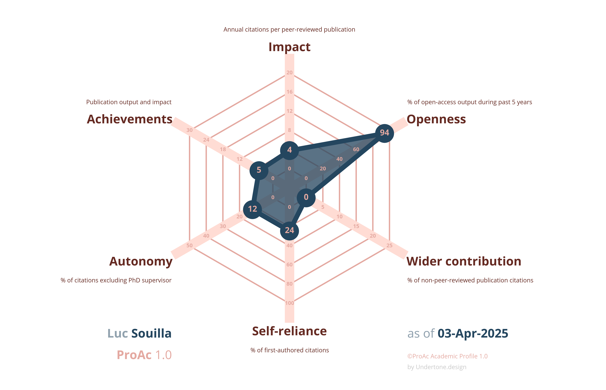

```{r setup, include=FALSE}
knitr::opts_chunk$set(echo = FALSE, warning = FALSE, message = FALSE)
library(vitae)
library(ggplot2)
library(dplyr)
library(sf)
library(rnaturalearth)
library(sfnetworks)
library(ggrepel)
library(emojifont)
library(fontawesome)
library(kableExtra)
library(huxtable)
library(gridExtra)
```


\faIcon{thumbtack} Current position
============================================
```{r echo=FALSE}
tribble(
  ~ degree, ~ uni, ~ loc, ~ dates, ~ details ,

  "Post-doctoral position", "Montreal Heart Institute - University of Montréal", "Montreal, Canada", "Nov. 2024 - Nov. 2026",
      list("Heat exposure and physiological and perceptual responses",
         "Supervised by Pr. Daniel Gagnon")
)%>%
detailed_entries(uni, dates, degree, loc, details)
```


\faIcon{university} Education
==================================

```{r education}

 tribble(
  ~ degree, ~ uni, ~ loc, ~ dates, ~ details ,

  "PhD Fellow and Associate Lecturer", "Sports Science Faculty", "Montpellier, France", "Oct. 2021 - Sept. 2024",
      list("Evaluation and optimisation of physical fitness and physical activity in children with inherited cardiac diseases",
         " Supervised by Pr. Pascal Amedro, Pr.Jean-Luc Pasquie, Pr.Denis Mottet"),

  # "MSc degree in Sports Science and Exercise Rehabilitation", "Sports Science Faculty", "Montpellier, France", "Sep. 2020 - July. 2021",
  #     list(" Sciences, Technology, Movement"),

  # "BSc in Sports Science - Exercise and Health", "Sports Science Faculty", "Toulouse and Montpellier, France", "Sep. 2018 - July. 2019",
  # list(" Exercise and chronic conditions ")

  )%>%
  detailed_entries(uni, dates, degree, loc, details)
```

\faIcon*{file} Selected Publications
===========================

\scriptsize


```{r}
#For a complete list of publications see [*my ORCID*](https://orcid.org/my-orcid?orcid=0000-0002-5773-1440).
```

- **Souilla, L.**, Werner, o., Huguet, H., [...], Amedro, P., (2025). [*Cardiopulmonary Fitness and Physical Activity Among Children and Adolescents With Inherited Cardiac Disease*](https://jamanetwork.com/journals/jamanetworkopen/fullarticle/2830581). JAMA Open. 

- **Souilla, L.**, Guillaumont, S., Auer, A., [...], Amedro, P., (2024). [*Cardiac rehabilitation in children and adolescents with long QT syndrome:the RYTHMO’FIT pilot study*](https://doi.org/10.1186/s13102-024-00941-2). BMC Sports Sci, Med and Rehab. 

- **Souilla, L.**, Amedro, P., Morrison, S., (2024). [*Children with cardiac disease and heat exposure: catastrophic converging consequences?*](https://journals.humankinetics.com/view/journals/pes/aop/article-10.1123-pes.2023-0086/article-10.1123-pes.2023-0086.xml). Pediatric Exercise Science.

- **Souilla, L.**, Larsen, A.C., Juhl, C., Skou, S.T., Bricca, A., (2024). [*Childhood and adolescence physical activity and multimorbidity later in life: A systematic review*](https://journals.sagepub.com/doi/10.1177/26335565241231403). Journal of Multimorbidity and Comorbidity,2024;14. doi: 10.1177/26335565241231403.

- **Souilla, L.**, Avesani, M., [...], Pasquie, J-L., Guillaumont,S., and Amedro, P., (2023). [*Cardiorespiratory fitness, muscle fitness, and physical activity in children with long QT syndrome: A prospective controlled study*](https://www.frontiersin.org/articles/10.3389/fcvm.2022.1081106/full). Front. Cardiovasc. Med. 9:1081106.

- Amedro, P., Gavotto, A., Huguet, H., **Souilla, L.**, [...] Guillaumont, S. (2024). [*Early hybrid cardiac rehabilitation in congenital heart disease: the QUALIREHAB multicentre randomized controlled trial*](https://doi.org/10.1093/eurheartj/ehae085). European Heart Journal.

- Amedro, P., Matecki, S., [...], **Souilla, L.**, [...], Gavotto, A. (2023). [*Reference Values of Cardiopulmonary Exercise Test Parameters in the Contemporary Paediatric Population*](https://doi.org/10.1186/s40798-023-00622-3). Sports Medicine

- Gavotto, A., Mura, T., [...], **Souilla, L.**, [...], Amedro, P. (2023). [*Reference values of aerobic fitness in the contemporary paediatric population*]( https://doi.org/10.1093/eurjpc/zwad054). European Journal of Preventive Cardiology.

<!-- - Amedro, P., Werner,O., [...], **Souilla, L.**, [...], Pasquie, JL. (2021). [*Health-related quality of life and physical activity in children with inherited cardiac arrhythmia or inherited cardiomyopathy: the prospective multicentre controlled QUALIMYORYTHM study rationale, design and methods*](https://doi.org/10.1186/s12955-021-01825-6). Health Qual Life Outcomes., 28;19(1):187. -->

```{r, out.width='57%', fig.align='center', fig.link="https://www.fabiocrameri.ch/proac/"}

```
<!-- [ProAc](https://www.fabiocrameri.ch/proac/) profile -->
<!-- ----------------------------------------------------- -->


\normalsize
\newpage

<!-- \faIcon{briefcase} Professional Experience -->
<!-- ============================================ -->

<!-- ```{r experience, eval = T} -->
<!-- tribble( -->
<!--   ~ position, ~ place, ~ loc, ~ dates, ~ details , -->

<!--   "Project manager","University of Sports Science","Montpellier, France", "Sept. 2023 - January. 2024", -->
<!--     list("Kickoff event on Sports and Climate Change",  -->
<!--          "Student awareness day on climate change and the environmental impact of sports"), -->

<!--   "Research Mobility", "Southern Denmark University - Department of Sports Science and Clinical Biomechanics", "Odense, Denmark", "May. 2023 - July. 2023", -->
<!--       list("ERC projet MOBILIZE", -->
<!--          "Effect of tailored exercise program on multimorbidity / Systematic review on physical activity, childhood and multimorbidity"), -->

<!--   "Research intern", "PhyMedExp - INSERM U1046", "Montpellier, France", "Sep. 2020 - July. 2021", -->
<!--       list("Supervised by Pascal Amedro", -->
<!--          "Cardiorespiratory fitness and muscular deconditioning in congenital Long QT syndrome children"), -->

<!--   "Research intern", "PhyMedExp - INSERM U1046", "Montpellier, France", "Sep. 2019 - July. 2020", -->
<!--   list("Supervised by Karen Lambert", -->
<!--          "Effects of exercise and polyphenols supplementation on cardiac hypertrophy in obese insulino-resistant rats."), -->

<!--   )%>% -->
<!--   detailed_entries(place, dates, position, loc, details) -->
<!-- ``` -->

\faIcon{chalkboard} Teaching Experience
============================================

```{r teaching, eval = T}

tribble(
  ~ position, ~ type, ~ loc, ~ dates, ~ details ,

  " Associate lecturer", "University of Montpellier","Montpellier, France", "2022-2024",
      list("Climate change, sustainability and sport sciences",
        "Cardiac anatomy and Physiology", "Functional Anatomy and Biomechanics", "Exercise physiology and Health") #Neurosciences and Sports","Scientific methods and identification of study design")
          

)%>%
  detailed_entries(type, dates, position, loc, details)
```


\faIcon{dollar-sign} Funding, Grants and Fellowships
============================================
```{r grants}

tribble(
  ~ name, ~ origin, ~ amount, ~ dates, ~ details ,

  "International mobility EXPLORE #4", "From Montpellier University of Excellence","5000€", "May-June 2023",
      list("PhD mobility to Danemark, working on ERC grant funded project: MOBILIZE"),

  "RYTHMO'FIT:interventional pilot study", " From Saint Pierre Fundation ","10 000 €", "July 2022",
      list("Exercise rehabilitation program for children with long QT syndrome "),

  "PhD fellowship", "From ED CBS2 Montpellier university ","110 000€", "Oct.2021-2024",
      list(" PhD fellowship on promotion of adapted physical activity in children/adolescent with heart diseases :example of inherited arrhytmias \\href{https://www.phymedexp.com/theses-soutenues-d/}{\\tiny{\\faIcon{link}}} "),

  "QUALIREHAB-ONCO: Effect of home based exercise rehabilitation program on  childhood cancer survivors ", "From ARC: Fundation for cancer research" ,"450 000$", "June 2021",
  list("Creation and drafting exercise program for childhood cancer survivors, final proof reading \\href{https://www.fondation-arc.org/projets/qualirehab-onco-remettre-les-enfants-au-sport-apres-un-cancer}{\\tiny{\\faIcon{link}}} ")

  
)%>%
  detailed_entries(origin, amount, name, dates, details)
```


<!-- \faIcon{comment} Communications -->
<!-- ============================================ -->

<!-- ```{r} -->
<!-- tribble( -->
<!--   ~ event, ~ type, ~ loc, ~ dates, ~ details , -->

<!--    "Scientific Research Day of Kinesiology and Physical Activity School ", "Poster Presentation", "Montréal, Canada", "March 2025", -->
<!--        list("Souilla L. (2025). In situ responses of elderly people living in social housing before, during, and after a heatwave. "), -->

<!--    "International Congress of Association for European Paediatric Congenital Cardiology", "Oral Presentation","Porto, Portugal", "May 2024", -->
<!--       list("Souilla L., Guillaumont S., ..., Amedro P.(2024). Cardiac rehabilitation in children and adolescents with long QT syndrome: the RYTHMO’FIT pilot study. International Congress of Association for European Paediatric Congenital Cardiology"), -->

<!--   "French federatation of Cardiology", "Oral Presentation", "Paris, France", "Sep. 2023", -->
<!--       list("Souilla L., Werner O., ..., Amedro P.(2023). Health-related quality of life and physical activity in children with inherited cardiac arrhythmia or inherited cardiomyopathy: the prospective multicentre controlled QUALIMYORYTHM. Research days of French federation of cardiology"), -->

<!--   "International Congress of Francophone Mother-Children network", "Oral presentation","Bordeaux, France", "June 2022", -->
<!--       list(" Souilla L.(2022). Adapted physical activity teacher: on the right track. International Congress of Francophone Mother-Children network"), -->

<!--   "French society of Paediatric", "Oral presentation","Lille, France", "June 2022", -->
<!--       list("Souilla L., Avesani M., Boisson A., Pasquie JL., Amedro P.(2022).  Cardiorespiratory fitness and muscular deconditioning children with Long QT syndrome. French society of Paediatric"), -->

<!--   "International Congress of Association for European Paediatric Congenital Cardiology", "Poster Presentation","Geneve, Switzerland", "May 2022", -->
<!--       list("Souilla L., Avesani M., Boisson A., Pasquie JL., Amedro P.(2022). Cardiorespiratory fitness and muscular deconditioning children with Long QT syndrome. International Congress of Association for European Paediatric Congenital Cardiology"), -->

<!--   detailed_entries(type, dates, event, loc, details) -->

<!-- ``` -->


\faIcon{brain} Skills
================================

\smallskip

\faIcon{users} Soft skills
---------------------------------
```{r workplace skills, results='markup'}
tribble(
    ~ Teamwork, ~Attributs,
"Pluridisciplinary Working -- Effective communication -- Autonomous writing -- Management of national clinicals trials",
  "Creativity -- Adaptability -- Time management -- Motivation -- Relationship skills"
) %>%
  kable(booktabs = T, align = 'c', escape = F, format = "latex") %>%
  kable_styling(full_width = F, font_size = 10, latex_options = "HOLD_position") %>%
  row_spec(0, bold = T, color = "#009acd") %>%
  row_spec(1, bold = F, color = "#7f7f7f") %>%
  column_spec(column = 1:2, width = '8 cm')
```

\faIcon{cogs} Technical skills
---------------------------------

```{r techtable, results='markup'}

tribble(
   ~`Tools`, ~Languages, ~Other,
  "CP Exercise testing -- Echocardiography -- Muscular ultrasound -- Accelerometer -- Force Sensor", 
  "French (native) -- English (C1) -- Spanish (B1) ", 
  "Git -- Markdown -- R -- Canva -- BioRender "  #Covidence #OSF # Scite
) |>
kable(booktabs = T, align = 'c', escape = F, format = "latex") |>
kable_styling(full_width = F, font_size = 10, latex_options = "HOLD_position") |>
row_spec(0, bold = T, color = "#009acd") |>
row_spec(1, bold = F, color = "#7f7f7f") |>
column_spec(column = 1:3, width = '4.75cm')
```


<!-- \faIcon{users} Memberships -->
<!-- ================================ -->

<!-- ```{r org} -->
<!-- tribble( -->
<!--   ~ position, ~ date, ~ org, -->

<!--   "Head of Green Researchers team working on evaluation and mitigation of the laboratory carbon footprint", "Aug. 2023-Oct. 2024", "Lab Euromov DHM", -->
<!--   "Head of pediatric commitee of the French Society of exercise physiologists", "Jan. 2023-Dec. 2023", "French society of exercise physiologists", -->
<!--   "Animator of Climate Fresk workshop in France", "Since 2023", "Climate Fresk Organisation ", -->
<!--   "Animator of 2 tonnes workshop in France", "Since 2023","2 Tonnes organization", -->
<!--   "Scientific member of QUALINEURO-REHAB European project", "Since 2022","Bordeaux University Hospital-INSERM", -->

<!-- ) %>% -->
<!--   brief_entries(what = position, when = date, with= org) -->
<!-- ``` -->


