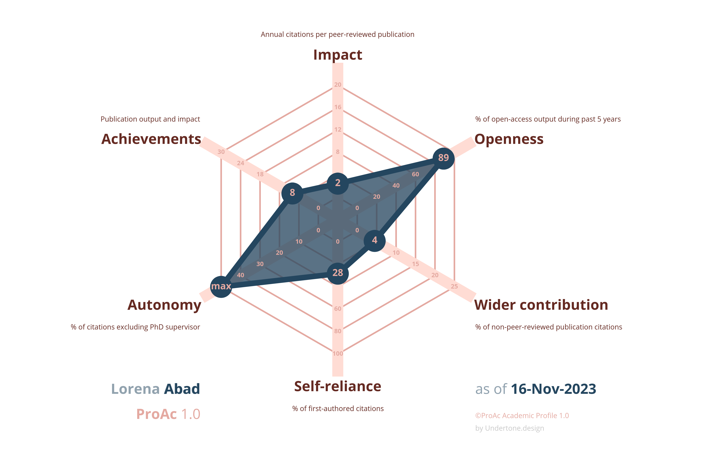

```{r setup, include=FALSE}
knitr::opts_chunk$set(echo = FALSE, warning = FALSE, message = FALSE)
library(vitae)
library(ggplot2)
library(dplyr)
library(sf)
library(rnaturalearth)
library(sfnetworks)
library(ggrepel)
library(emojifont)
library(fontawesome)
library(kableExtra)
library(huxtable)
library(gridExtra)
```

# \faIcon{user-circle} About me

During my PhD, I assessed health-related physical fitness and physical activity, and implemented cardiac rehabilitation programs for children and adolescents with inherited cardiac diseases. I am currently pursuing a post-doctoral position, concentrating on the impact of heat exposure on the health of children with heart diseases.

<!-- | Nationality: French, Birthdate: 28/09/1998 -->


# \faIcon{thumbtack} Current position
```{r echo=FALSE}
tribble(
  ~ degree, ~ uni, ~ loc, ~ dates, ~ details ,

  "Post-doctoral position", "EPIC center - Montreal Heart Institute", "Montreal, Canada", "Nov. 2024 - Nov. 2026",
      list("Impact of prolonged heat on health",
         "Supervised by Pr. Daniel Gagnon")
)%>%
detailed_entries(uni, dates, degree, loc, details)
```


\faIcon{university} Education
==================================

```{r education}

 tribble(
  ~ degree, ~ uni, ~ loc, ~ dates, ~ details ,

  "PhD Fellow and Associate Lecturer", "Sport Science Faculty - Montpellier University", "Montpellier, France", "Oct. 2021 - Sept. 2024",
      list("Evaluation and optimisation of physical fitness and physical activity in children with inherited cardiac diseases",
         " Supervised by Pr. Pascal Amedro, Pr.Jean-Luc Pasquie, Pr.Denis Mottet"),

  "MSc degree in sport sciences and exercise rehabilitation", "Sport Science Faculty", "Montpellier, France", "Sep. 2020 - July. 2021",
      list(" Sciences, Technology, Movement, top of the class."),

  "BSc in sport Sciences - exercise and health", "Sport Science Faculty", "Toulouse and Montpellier, France", "Sep. 2018 - July. 2019",
  list(" Exercise and chronic conditions, top of the class. ")

 # "High-School Diploma in Science", "Pierre D'Aragon High School", "Muret, France", #"Sep. 2016 - July. 2017",
  #list("Physics, Chemistry, Maths, Life sciences.",
    #   "good rank.")
  )%>%
  detailed_entries(uni, dates, degree, loc, details)
```

\faIcon*{file} Selected Publications
===========================

\scriptsize


```{r}
#For a complete list of publications see [*my ORCID*](https://orcid.org/my-orcid?orcid=0000-0002-5773-1440).
```

- **Souilla, L.**, Werner, o., Huguet, H., [...], Amedro, P., (2025). [*Cardiopulmonary Fitness and Physical Activity Among Children and Adolescents With Inherited Cardiac Disease*](https://jamanetwork.com/journals/jamanetworkopen/fullarticle/2830581). JAMA Open. 

- **Souilla, L.**, Guillaumont, S., Auer, A., [...], Amedro, P., (2024). [*Cardiac rehabilitation in children and adolescents with long QT syndrome:the RYTHMO’FIT pilot study*](https://doi.org/10.1186/s13102-024-00941-2). BMC Sports Sci, Med and Rehab. 

- **Souilla, L.**, Amedro, P., Morrison, S., (2024). [*Children with cardiac disease and heat exposure: catastrophic converging consequences?*](https://journals.humankinetics.com/view/journals/pes/aop/article-10.1123-pes.2023-0086/article-10.1123-pes.2023-0086.xml). Pediatric Exercise Science.

- **Souilla, L.**, Larsen, A.C., Juhl, C., Skou, S.T., Bricca, A., (2024). [*Childhood and adolescence physical activity and multimorbidity later in life: A systematic review*](https://journals.sagepub.com/doi/10.1177/26335565241231403). Journal of Multimorbidity and Comorbidity,2024;14. doi: 10.1177/26335565241231403.

- **Souilla, L.**, Avesani, M., [...], Pasquie, J-L., Guillaumont,S., and Amedro, P., (2023). [*Cardiorespiratory fitness, muscle fitness, and physical activity in children with long QT syndrome: A prospective controlled study*](https://www.frontiersin.org/articles/10.3389/fcvm.2022.1081106/full). Front. Cardiovasc. Med. 9:1081106.

- Amedro, P., Gavotto, A., Huguet, H., **Souilla, L.**, [...] Guillaumont, S. (2024). [*Early hybrid cardiac rehabilitation in congenital heart disease: the QUALIREHAB multicentre randomized controlled trial*](https://doi.org/10.1093/eurheartj/ehae085). European Heart Journal.

- Amedro, P., Matecki, S., [...], **Souilla, L.**, [...], Gavotto, A. (2023). [*Reference Values of Cardiopulmonary Exercise Test Parameters in the Contemporary Paediatric Population*](https://doi.org/10.1186/s40798-023-00622-3). Sports Medicine

- Gavotto, A., Mura, T., [...], **Souilla, L.**, [...], Amedro, P. (2023). [*Reference values of aerobic fitness in the contemporary paediatric population*]( https://doi.org/10.1093/eurjpc/zwad054). European Journal of Preventive Cardiology.

- Amedro, P., Werner,O., [...], **Souilla, L.**, [...], Pasquie, JL. (2021). [*Health-related quality of life and physical activity in children with inherited cardiac arrhythmia or inherited cardiomyopathy: the prospective multicentre controlled QUALIMYORYTHM study rationale, design and methods*](https://doi.org/10.1186/s12955-021-01825-6). Health Qual Life Outcomes., 28;19(1):187.


\normalsize


\faIcon{briefcase} Professional Experience
============================================

```{r experience, eval = T}
tribble(
  ~ position, ~ place, ~ loc, ~ dates, ~ details ,
  
  "Project manager","University of Sport Science","Montpellier, France", "Sept. 2023 - January. 2024",
    list("Kickoff event on Sports and Climate Change", 
         "Organizing an awareness day on climate change and the impact of sports for students"),
  
  "Research Mobility", "Southern Denmark University - Department of Sport Sciences and Clinical Biomechanics", "Odense, Denmark", "May. 2023 - July. 2023",
      list("ERC projet MOBILIZE",
         "Effect of tailored exercise program on multimorbidity / Systematic review on physical activity, childhood and multimorbidity"),
  
  "Research intern", "PhyMedExp - INSERM U1046", "Montpellier, France", "Sep. 2020 - July. 2021",
      list("Supervised by Pascal Amedro",
         "Cardiorespiratory fitness and muscular deconditioning in congenital Long QT syndrome children"),

  "Research intern", "PhyMedExp - INSERM U1046", "Montpellier, France", "Sep. 2019 - July. 2020",
  list("Supervised by Karen Lambert",
         "Effects of exercise and polyphenols supplementation on cardiac hypertrophy in obese insulino-resistant rats."),

  #"Adapted Physical Activity Teacher", "Paediatric Rehabilitation Center", "Palavas-Les-Flots, France", "July. 2019",
  #list("Cardiology, Obesity and Diabetes ",
         #"Creation and animation of adapted training sessions based on multiple physical activities")

  #"Adapted Physical activity intern Student", "Paediatric Rehabilitation Center", "Palavas-Les-Flots, France", "January. 2019",
 # list(" Cardiology, Obesity and Motricity disabilities ",
       #  "Creation and animation of adapted training sessions based on multiple physical activities"),

  # "Employé Municipal", "Mairie Montesquieu", "Montesquieu-Volvestre, France", "Summer. 2019",
  #list(" 5 semaines - 105h ",
    #     "Entretien des aespaces verts, organisation de fête du village"),

  #"Stagiaire EAPA", "Étincelle occitanie", "Montpellier, France", "2018",
 # list(" Maison associative cancer du sein - 75h ",
   #      "Création de séances d'APA pour les femmes ayant eu un cancer du sein"),

   #" Stagiaire EAPA", "Réseau Partn'Air ", "Saint_orens, France", "2018",
 # list(" Réseau de santé pathologies respiratoires et hémopathies maligne ",
    #     "Création de séances d'APA pour des patients en centre ou domicile ayant une affectation respiratoire"),

  #" Stagiaire EAPA", "SADIR Assistance", "Portet-Sur-Garonne, France", "2017",
 # list(" Prestataire de santé avec pathologies respiratoires- 50h ",
    #     "Création de séances d'APA pour des patients ayant une affectation respiratoire"),

  #" Préparateur Physique EAPA", "Iron Club", "Toulouse France", "2018",
  #list(" Basket Fauteuil- Professionnel ",
       #  "Animation séance cardio et Renforcement musculaire"),

  #" Stagiaire EAPA", "A.S.E.I Philae", "Ramonville, France", "2018",
#  list(" Centre d'accueil pour enfants/ado atant des affections neurologiques- 50h ",
        # "Création de séances d'APA, observation, rendu rapport de stage"),

 # " Employé logistique ", "IKEA", "Roques-Sur-Garonne, France", "2017",
  #list("Travail dépot et magasin ",
        # "Port d'objets lourds, mise en rayon, conseil client"),

  #" Employé libre service ", "Carrefour City", "Toulouse, France", "2017",
  #list("Caisse et facing dans rayon ",
     #    "Rayon boulangerie, caisse, fermeture magasin, nettoyage"),
  )%>%
  detailed_entries(place, dates, position, loc, details)
```

\faIcon{chalkboard} Teaching Experience
============================================

```{r teaching, eval = T}

tribble(
  ~ position, ~ type, ~ loc, ~ dates, ~ details ,

  " Associate lecturer", "University of Montpellier","Montpellier, France", "2022-2024",
      list("Climate change, sustainability and sport sciences",
        "Cardiac anatomy and physiology", "functional anatomy and biomechanics", "exercise physiology and health, neurosciences and sports","Scientific methods and identification of study design"
          )

  # "Mentoring Student Certification ", "University of Montpellier - 150 hours","Montpellier, France", "2019 - 2021",
  #     list(" Helping bachelor's student in Sports sciences students",
  #     "Exercise Biomechanics, exercise physiology, functional anatomy and neurosciences"),
)%>%
  detailed_entries(type, dates, position, loc, details)
```


\faIcon{handshake} Supervision mentoring
============================================

```{r}

tribble(
  ~ student, ~ type, ~ loc, ~ dates, ~ details ,
  
   "Mentoring MSc Student", "Sports Science University ","Bordeaux, France", "Oct. 2023-Oct. 2024",
      list("Trained to cardiopulmonary exercise testing and accelerometry and designing research protocols",
           "Help designing research protocol and writing dissertation and call for funding"), 
  
  "Mentoring BSc Student", "Sports Science University", "Montpellier, France", "Oct. 2023-Dec. 2023",
      list("Mentoring student on the kickoff event on Sports and Climate Change",
           "Individual support for developing their personals projects"),

  "Mentoring MSc Student", "University Hospital of Pediatric Cardiology ","Bordeaux, France", "January 2023",
      list("Help designing exercise interventions and writing dissertation and call for funding"),


 # "Mentoring BSc Student", "Cardiology Paediatric Rehabilitation center ","Palavas-Les-Flots, France", "January 2022",
     # list("Mentoring Julie Voldoire (BSc student) during their internship and discover scientifc area"),

)%>%
  detailed_entries(type, dates, student, loc, details)
```


# \faIcon{comment} Communications

```{r}
tribble(
  ~ event, ~ type, ~ loc, ~ dates, ~ details ,
  
  # "Centre ÉPIC MENSUELLE", "Oral Presentation","Montréal, Canada", "February 2025",
  #     list("Souilla L. (2025). Health-related physical fitness, physical activity and cardiac rehabilitation in children and adolescents with inhertied cardiac condition: un avenir prometteur?. "),
  # Eventuellement ajouter l'AEPC 2025 
   "International Congress of Association for European Paediatric Congenital Cardiology", "Oral Presentation","Porto, Portugal", "May 2024",
      list("Souilla L., Guillaumont S., ..., Amedro P.(2024). Cardiac rehabilitation in children and adolescents with long QT syndrome: the RYTHMO’FIT pilot study. International Congress of Association for European Paediatric Congenital Cardiology"),
  
  "Heart and sport days of Cardiogen", "Oral Presentation", "Montpellier, France", "Jan. 2024",
      list("Souilla L.(2024). Role of adapted physical activity in pediatric cardiac rehabilitation. Heart and sport days of Cardiogen"),
  
  "French federatation of Cardiology", "Oral Presentation", "Paris, France", "Sep. 2023",
      list("Souilla L., Werner O., ..., Amedro P.(2023). Health-related quality of life and physical activity in children with inherited cardiac arrhythmia or inherited cardiomyopathy: the prospective multicentre controlled QUALIMYORYTHM. Research days of French federation of cardiology"),
  
  "International Congress of Francophone Mother-Children network", "Oral presentation","Bordeaux, France", "June 2022",
      list(" Souilla L.(2022). Adapted physical activity teacher: on the right track. International Congress of Francophone Mother-Children network"),

  "French society of Paediatric", "Oral presentation","Lille, France", "June 2022",
      list("Souilla L., Avesani M., Boisson A., Pasquie JL., Amedro P.(2022).  Cardiorespiratory fitness and muscular deconditioning children with Long QT syndrome. French society of Paediatric"),

  "International Congress of Association for European Paediatric Congenital Cardiology", "Poster Presentation","Geneve, Switzerland", "May 2022",
      list("Souilla L., Avesani M., Boisson A., Pasquie JL., Amedro P.(2022). Cardiorespiratory fitness and muscular deconditioning children with Long QT syndrome. International Congress of Association for European Paediatric Congenital Cardiology"),

  "Annual days of Cardiogen", "Oral presentation","Bordeaux, France", "March 2022",
     list(" Souilla L., Avesani M., Boisson A., Pasquie JL., Amedro P.(2022). Evaluation of cardiorespiratory fitness and muscular deconditioning in children with Long QT syndrome. Annual days of Cardiogen"),

  "Congress of French society of Paediatrics and congenital cardiology ", "Oral presentation","Nice, France", "Sept. 2021",
      list("Souilla L.(2021). Exercise rehabilitation in heart failure. Congress of French society of Paediatrics and congenital cardiology"),

  #"Days of adapted physical activity", "Poster presentation","Montpellier, France", "April, 2019",
  #    list("Souilla L., Home-based exercise program for management of tiredness post-transplantation. Days of adapted physical"),
)%>%
  detailed_entries(type, dates, event, loc, details)

```

```{r, out.width='57%', fig.align='center', fig.link="https://www.fabiocrameri.ch/proac/"}

```
<!-- [ProAc](https://www.fabiocrameri.ch/proac/) profile -->
<!-- ----------------------------------------------------- -->

<!--
\faIcon{lightbulb} Projects
=====================================

\smallskip

\faIcon{satellite} Research projects
---------------------------------
<!-- \par\noindent\nobreak\vspace{-30pt}\rule{\textwidth}{1pt} -->

<!--
```{r proj}
#tribble(
 # ~ name, ~ acronym, ~ date, ~ study_type,

#"Quality of life exercise capacity and physical activity of children with inherited cardiac disease", "QUALIYMORYTHM", "2021 - 2023",("Multicentric Controlled Trial \\href{https://clinicaltrials.gov/ct2/show/NCT04712136/}{\\tiny{\\faIcon{link}}}"),

#"Exercise rehabilitation of children with long QT", "RYTHMO'FIT", "2022 - 2023",("Interventional Pilot study"), #\\href{https://clinicaltrials.gov/ct2/show/NCT04712136/}{\\tiny{\\faIcon{link}}}"),

#"Home based exercise rehabilitation and cognitive training in children and adolescent with congenital heart defect", "QUALINEUROREHAB", "2023 - 2025",("European interventional trial \\href{https://clinicaltrials.gov/ct2/show/NCT05670132}{\\tiny{\\faIcon{link}}}"),

#"Exercise rehabilitation for children with congenital heart defects and physical activity of children with inherited cardiac disease", "QUALIREHAB", "2018 - 2023",("Randomised Controlled Trial \\href{https://clinicaltrials.gov/ct2/show/NCT03690518}{\\tiny{\\faIcon{link}}}"),

#penser  a ajouter etude sur envionnement avec Shawnda et L'étude avec danemark
#)%>%
#detailed_entries(with = acronym, what = name, when = date, where = study_type,
#.protect=FALSE)
```

\smallskip

\faIcon{laptop-code} Programming projects
----------------------------------
<!-- \par\noindent\nobreak\vspace{-30pt}\rule{\textwidth}{1pt} -->

<!--
```{r dev}
tribble(
  ~ name, ~ sum, ~ acronym, ~ type, ~ lang, ~ link,
  "Landslide dammed-lakes detection and monitoring after the Kaikōura earthquake in New Zealand", 
  "GEE project: Landslide dammed-lakes detection and monitoring in Kaikōura, NZ",
  "Kaikoura landslide dammed-lakes \\href{https://github.com/loreabad6/KaikouraDammedLakes_public}{\\tiny{\\faLink}}", 
  "GEE project",
  "JavaScript",
  "\\href{https://github.com/loreabad6/KaikouraDammedLakes_public}{\\faGithub}",
  
  "Blog: Lore Abad", 
  "Lore Abad: Distill blog with my data science work", 
  "Blog \\href{https://loreabad6.github.io/}{\\tiny{\\faLink}}", 
  "Distill blog",
  "R",
  "\\href{https://loreabad6.github.io/}{\\faGlobe}",
  
  "Tidy Geospatial Networks in R", 
  "\\textit{sfnetworks} Tidy Geospatial Networks in R", 
  "sfnetworks \\href{https://luukvdmeer.github.io/sfnetworks/}{\\tiny{\\faLink}}", 
  "R Package",
  "R",
  "\\href{https://luukvdmeer.github.io/sfnetworks/}{\\faGithub}",
  
  "Bicycle Network Analysis Score for UK and NL",
  "BNA-EU: Bicycle Network Analysis Score for UK and NL",
  "BNA-EU \\href{https://github.com/loreabad6/masters-thesis-geotech}{\\tiny{\\faLink}}", 
  "RMarkdown Reporting",
  "R \\& SQL",
  "\\href{https://github.com/loreabad6/masters-thesis-geotech}{\\faGithub}"
) |> 
  brief_entries(with = lang, what = sum, when = link, .protect=FALSE)  
```
-->
<!--

\faIcon{comments} Presentations, blogs, courses
================================

```{r presentations}
tribble(
  ~ title, ~ link, ~ event, ~ date,
  "Mapping and monitoring landslide-dammed lakes in Kaikōura, New Zealand, using the Google Earth Engine", "Lightning Talk at the Geo For Good 2020 Summit Public Sector Meetup \\href{https://www.youtube.com/watch?v=CbHYkUpCwCI&ab_channel=GoogleEarth}{\\tiny{\\faIcon{link}}}", "Geo for Good 2020", "10, 2020",
  "El rol de las tecnologías geoespaciales para el mapeo y monitoreo de peligros naturales", "Invited talk at the event 'Voces de la Ingeniería Ambiental' \\href{https://loreabad6.github.io/VocesAmbiental/presentacion.html}{\\tiny{\\faIcon{link}}}", "Voces Ambiental 2020", "09, 2020",
  "Bicycle Network Analysis for assessing cyclability", "Presentation during Cycling Potential Hackathon: Lisbon \\href{https://github.com/U-Shift/cyclingpotential-hack}{\\tiny{\\faIcon{link}}}", "U-Shift event", "09, 2020",
  "Implementing geo citizen science solutions: experiences from the citizenMorph project", "Full paper presentation in session C43: Spatial Citizens Science \\href{https://www.conftool.com/giweek2020/index.php?page=browseSessions&form_session=202}{\\tiny{\\faIcon{link}}}", "Gi-Forum 2020", "07, 2020",
  "Tidy Geospatial Networks in R: Introducing the sfnetworks package", "Webinar \\& Hackathon \\href{https://sfnetworks.github.io/sfnetworks-webinar/slides}{\\tiny{\\faIcon{link}}}", "e-Rum 2020 satellite event", "06, 2020",
  "Mapping and monitoring of landslide-dammed lakes using Sentinel-2 time series", "Display in session Natural Hazards NH6.1 \\href{https://presentations.copernicus.org/EGU2020/EGU2020-572_presentation.pdf}{\\tiny{\\faIcon{link}}}", "EGU 2020", "05, 2020",
  "Intro to spatial vector data analysis with R","R spatial crash course \\href{https://luukvdmeer.github.io/maptimeR/exercises.html}{\\tiny{\\faIcon{link}}}", "Maptime Salzburg", "02, 2020",
  "Spatial networks in R with sf and tidygraph", "Blogpost \\href{https://www.r-spatial.org/r/2019/09/26/spatial-networks.html}{\\tiny{\\faIcon{link}}}", "r-spatial blog", "09, 2019",
  "Bicycle Network Analysis for Lisbon", "Short Paper Presentation in the 2nd Open Data for Open Cities Workshop \\href{https://github.com/GeoTecINIT/OpenData4OpenCities/blob/master/Presentations/AGILE_2018_Presentation_Abad-vdMeer.pdf}{\\tiny{\\faIcon{link}}}", "AGILE Workshop: OD4OC", "06, 2018",
  "Exploring Space-Time Patterns Of Volunteered Cycling Data In An Intermediate City", "Abstract Presentation", "GeoMundus 2017", "11, 2017"
) |> 
  detailed_entries(with = title, what = link, where = event, when = date, .protect=FALSE)  
```
-->

<!-- \faIcon{medal} Awards & Distinctions -->
<!-- =============================== -->

```{r dist}
# tribble(
#   ~ area, ~ org, ~ date,
#   "FOSS4G 2022 conference - travel grant", "OSGeo Foundation", "2022",
#   "Copernicus Masters Austria price (2nd place)", "Copernicus Masters", "2020",
#   "ISC funding for {sfnetworks}", "R-Consortium", "2019",
#   "Benigno Malo Prize - University Honors Award", "Universidad de Cuenca", "2018",
#   "AGILE 2018 conference - travel grant", "AGILE \\& ESRI", "2018",
#   "Erasmus Mundus Scholarship", "European Commission", "2017",
#   # "Best Scientific Poster - 2nd International Summer School \\newline 
# # ``The Biodiversity of Genes, Species and Ecosystems''", "Universität Osnabrück","2015",
#   "Vanguardia Honors Program", "Universidad de Cuenca", "2014 - 2016"
# ) |> 
#   brief_entries(what = area, when = date, with = org, .protect = F)
```

<!-- \faIcon{hand-holding-heart} Volunteer work -->
<!-- =============================== -->

```{r vol}
# tribble(
#   ~ desc, ~ date,
#   "Group Peer Mentor in Women in Geospatial+ Mentorship Program", "2020-2021"
# ) |>
#   brief_entries(what = desc, when = date, .protect = F)
```

\faIcon{brain} Skills
================================

\smallskip

\faIcon{language} Languages
-------------------------------

```{r langforeign, results='markup'}
data.frame(
  Skill = c("Reading", "Writing", "Listening","Speaking"),
  Spanish = cell_spec(c(rep("Native", 4)), 'latex', color = '#005c7b'), 
  English = cell_spec(c("C2","C1","C2","C2"), 'latex', color = '#009acd'), 
  French = cell_spec(c("B2","B2","B2","B1"), 'latex', color = '#4cb8dc'), 
  German = cell_spec(c("B1","B1","B1","B1"), 'latex', color = '#4cb8dc'), 
  Portuguese = cell_spec(c("B1","A2","B1","A2"), 'latex', color = '#4cb8dc'), 
  Dutch = cell_spec(c("A2","A1","A2","A2"), 'latex', color = '#7fcce6') 
) |>
  kable(booktabs = T, align = 'c', escape = F, format = "latex") |>
  kable_styling(full_width = F, font_size = 9, latex_options = "HOLD_position") |> 
  footnote(
    footnote_as_chunk = T,
    general_title = " ",
    general = "\\\\tiny Common European Framework of Reference for Languages: A1/A2: Basic User. B1/B2: Independent User. C1/C2: Proficient User",
    escape = F
  ) |>
  column_spec(column = 1:6, width = '2.4cm') #|> 
  # add_header_above(' ', line = F) |>
  # row_spec(0:4, extra_latex_after = "\\arrayrulecolor{white}") 
```

\faIcon{cogs} Technical skills
---------------------------------

```{r techtable, results='markup'}
# tribble(
#    ~type, ~desc,
#    "Coding Languages",
#     "R -- Python -- SQL -- JavaScript",
#    "Software",
#   "QGIS -- Earth Engine -- SAGA -- PostgreSQL -- ArcGIS -- GIMP",
#    "Other",
#   "Git -- Markdown -- LaTex -- OpenStreetMap"
# ) |>
#   brief_entries(what = desc, with = type, .protect = F)
tribble(
   ~`Coding Languages`, ~Software, ~Other,
  "R -- Python -- SQL -- JavaScript",
  "QGIS -- Earth Engine -- SAGA -- PostgreSQL -- ArcGIS -- GIMP",
  "Git -- Markdown -- LaTex -- OpenStreetMap"
) |>
kable(booktabs = T, align = 'c', escape = F, format = "latex") |>
kable_styling(full_width = F, font_size = 8, latex_options = "HOLD_position") |>
row_spec(0, bold = T, color = "#009acd") |>
row_spec(1, bold = F, color = "#7f7f7f") |>
column_spec(column = 1:3, width = '4.75cm')
```
<!-- \faIcon{calendar} Organizational skills -->
<!-- ------------------------------ -->
```{r events, eval = FALSE}
# tribble(
#   ~ event, ~ date, ~ place,
#   "FOSS4G workshop - sfnetworks: Tidy Geospatial Networks in R \\href{https://github.com/sfnetworks/foss4g-workshop}{\\tiny{\\faIcon{link}}}", "08, 2022", "Florence, Italy",
#   "e-Rum 2020 satellite event: \\textit{sfnetworks} Webinar and Hackathon \\href{https://2020.erum.io/program/hackathon/}{\\tiny{\\faIcon{link}}}", "06, 2020", "Online Event",
#   "citizenMorph App Testing Workshop", "09, 2019", "Höfn, IS",
#   "GeoMundus 2018 \\href{http://www.geomundus.org/2018/}{\\tiny{\\faIcon{link}}}", "12, 2018", "Lisbon, PT",
#   "I University Simposium of Environmental Science Research", "06, 2016", "Cuenca, EC",
#   "Vicepresident of the Student Association of Environmental Engineers", "2013 - 2014", "Cuenca, EC",
# ) |> 
#   brief_entries(what = event, when = date, with = place, .protect = F)
```

<!-- \faIcon{users} Memberships -->
<!-- =============================== -->

```{r org, eval = FALSE}
tribble(
  ~ org, ~ date,
  "R-Ladies Global \\href{https://rladies.org/austria-rladies/name/lorena-abad/}{\\tiny{\\faIcon{link}}}", "since 2020",
  "Women+ in Geospatial \\href{https://speakers.womeningeospatial.org/speakers}{\\tiny{\\faIcon{link}}}", "since 2020",
  "European Geosciences Union", "since 2020",
  "Erasmus Mundus Association", "since 2020"
) |>
  brief_entries(what = org, when = date, .protect = F)
```

<!-- \faIcon{comment} References -->
<!-- ============================= -->

<!-- \footnotesize -->

<!-- - **Prof. Dr. Edzer Pebesma**, Institute for Geoinformatics, University of Muenster, edzer.pebesma@uni-muenster.de -->

<!-- - **Prof. Dr. Marco Painho** NOVA Information Management School, painho@novaims.unl.pt -->

<!-- - **Dr. Daniel Hölbling**, Department of Geoinformatics - Z\_GIS, PLUS, daniel.hoelbling@plus.ac.at -->

<!-- \normalsize -->

<!-- \footnotesize -->
<!-- \begin{multicols}{3} -->
<!-- \begin{center} -->

<!-- \textbf{Prof. Dr. Edzer Pebesma} \newline -->
<!-- \faIcon{phone} +49 251 83-33081 \newline -->
<!-- \faIcon{at} edzer.pebesma@uni-muenster.de \newline -->
<!-- \faIcon{envelope} Institute for Geoinformatics \newline -->
<!-- Heisenbergstraße 2, \newline -->
<!-- 48149 Münster, Germany -->

<!-- \textbf{Prof. Dr. Marco Painho} \newline -->
<!-- \faIcon{phone} +351 213 871 573 \newline -->
<!-- \faIcon{at} painho@novaims.unl.pt \newline -->
<!-- \faIcon{envelope} NOVA Information Management School \newline -->
<!-- Campus de Campolide\newline -->
<!-- 1070-312 Lisbon, Portugal -->

<!-- \textbf{Mag. Daniel Hölbling} \newline -->
<!-- \faIcon{phone} +43 (0)662 8044 7581 \newline -->
<!-- \faIcon{at} daniel.hoelbling@plus.ac.at \newline -->
<!-- \faIcon{envelope} Department of Geoinformatics - Z\_GIS 'newline -->
<!-- Schillerstrasse 30 \newline -->
<!-- 5020 Salzburg, Austria -->
<!-- \end{center} -->
<!-- \end{multicols} -->

<!-- \normalsize -->
